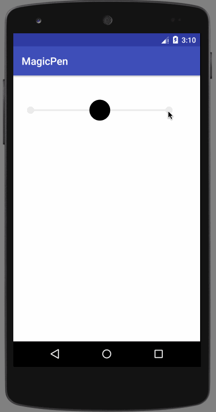

## MagicPen
a Kotlin DSL Lib to help create custom view in Android


#### How to use ?
```
magicPen {
	circle {
		radius = 50f
		center = PointF(100f, 100f)
	}
	...
}
```

just like the way you create layout

#### More Demo
```
magicPen {
    val aLine = line {	
        start = PointF(0f, 1000f) // 线条起点
        end = PointF(1000f, 1000f) // 线条终点
    }

    val bigCircle = circle {
        radius = 200f // 圆半径

        aboveOf(aLine) // 在线条上面
        leftMargin = 500f // 左边距
        bottomMargin = 10f // 下边距

        paint = Paint().apply { color = Color.RED } // 红色
    }

    text {
        content = "我是一只小小鸟"
        paint = Paint().apply { textSize = 40f }
        centerIn(bigCircle)
    }

    circle {
        radius = 50f // 半径
        centerIn(bigCircle) // 在大圆中间

        gesture {
            onClick = { toast("clicked") } // 点击时弹框
            onDragBy = { x, y -> moveBy(x, y) } // 跟着拖动的手指动
            onRelease = { _, _ -> smoothMoveToOrigin() } // 放手后滑动到原点
        }
    }

    rect {
        width = 300f
        height = 200f

        belowOf(bigCircle)
        topMargin = 50f

        alignLeft(bigCircle)
        leftMargin = 50f
    }
}
```

	

```
magicPen {
    rect { // 线条
        left = firstCenterX
        right = secondCenterX
        top = centerY - 5
        bottom = centerY + 5

        paint = grayPaint
    }

    circle { // 圆点
        radius = 30f
        center = PointF(firstCenterX, centerY)

        paint = grayPaint

        gesture {
            onClick = { // 点击时将按钮移动过来
                button.src = R.mipmap.slide_button_left_normal
                button.smoothMoveCenterTo(firstCenterX, centerY)
            }
        }
    }

    circle { // 圆点
        radius = 30f
        center = PointF(secondCenterX, centerY)

        paint = grayPaint

        gesture {
            onClick = { // 点击时将按钮移动过来
                button.src = R.mipmap.slide_button_right_normal
                button.smoothMoveCenterTo(secondCenterX, centerY)
            }
        }
    }

    button = bitmap { // 中间按钮
        val divideX1 = centerX - 150 // left  区域和 center 区域的交接点
        val divideX2 = centerX + 150 // right 区域和 center 区域的交接点

        width = 120f
        height = 120f
        center = PointF(centerX, centerY)
        src = R.mipmap.slide_button_center_normal // file = "..."

        gesture {
            onDragBy = { x, _ ->
                val targetX = x + downPoint.x
                if (targetX in firstCenterX..secondCenterX) { // 在指定范围内跟着手指拖动（仅 X 轴）
                    src = when(targetX) { // 根据不同的位置，加载不同的资源
                        in 0f..divideX1 -> R.mipmap.slide_button_left_pressed
                        in divideX2..Float.MAX_VALUE -> R.mipmap.slide_button_right_pressed
                        else -> R.mipmap.slide_button_center_pressed
                    }

                    moveBy(x, 0f)
                }
            }

            onRelease = { x, _ ->
                val targetX: Float // 在不同位置放手，移动至不同的位置
                when(x) {
                    in 0f..divideX1 -> {
                        targetX = firstCenterX
                        src = R.mipmap.slide_button_left_normal
                    }
                    in divideX2..Float.MAX_VALUE -> {
                        targetX = secondCenterX
                        src = R.mipmap.slide_button_right_normal
                    }
                    else -> {
                        targetX = centerX
                        src = R.mipmap.slide_button_center_normal
                    }
                }

                smoothMoveCenterTo(targetX, centerY)
            }
        }
    }
}
```




