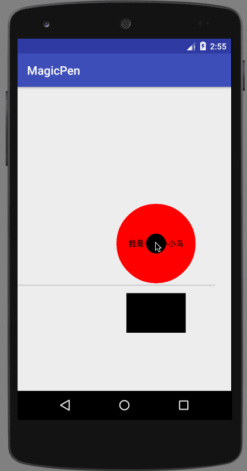

## MagicPen
a Kotlin DSL Lib to help create custom view in Android


#### How to use ?
```
magicPen {
	circle {
		radius = 50f
		center = PointF(100f, 100f)
	}
	...
}
```

just like the way you create layout

#### More Demo
```
magicPen {
    val aLine = line {	
        start = PointF(0f, 1000f) // 线条起点
        end = PointF(1000f, 1000f) // 线条终点
    }

    val bigCircle = circle {
        radius = 200f // 圆半径

        aboveOf(aLine) // 在线条上面
        leftMargin = 500f // 左边距
        bottomMargin = 10f // 下边距

        paint = Paint().apply { color = Color.RED } // 红色
    }

    text {
        content = "我是一只小小鸟"
        paint = Paint().apply { textSize = 40f }
        centerIn(bigCircle)
    }

    circle {
        radius = 50f // 半径
        centerIn(bigCircle) // 在大圆中间

        gesture {
            onClick = { toast("clicked") } // 点击时弹框
            onDragBy = { x, y -> moveBy(x, y) } // 跟着拖动的手指动
            onRelease = { _, _ -> smoothMoveToOrigin() } // 放手后滑动到原点
        }
    }

    rect {
        width = 300f
        height = 200f

        belowOf(bigCircle)
        topMargin = 50f

        alignLeft(bigCircle)
        leftMargin = 50f
    }
}
```

	

